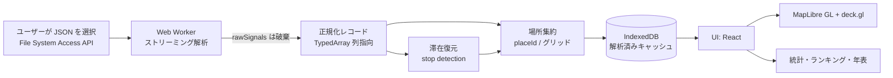
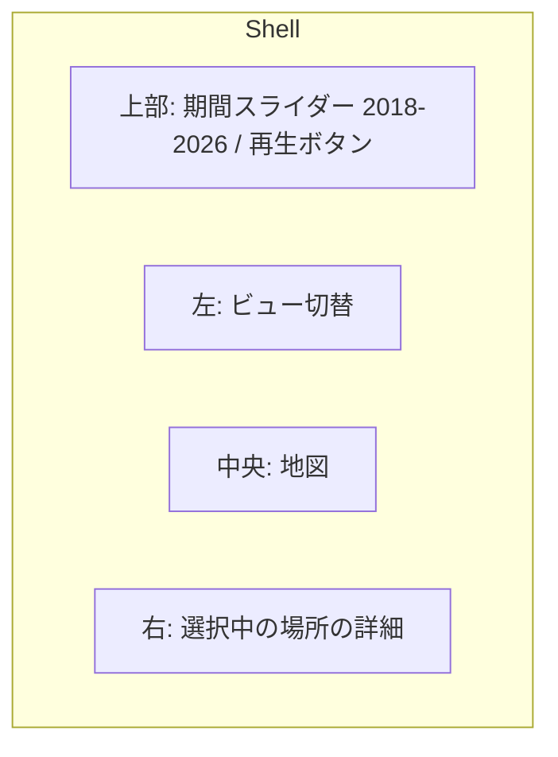

# MyGravityMap 設計書 (v0.1 ドラフト)

Google マップのタイムライン履歴から「自分がどこに引き寄せられて生きてきたか」を
可視化するブラウザアプリ。**データは一切サーバへ送らない**（完全クライアントサイド）。

- 作成日: 2026-08-20
- ステータス: ドラフト（実装着手前のレビュー用）

---

## 1. 実データの調査結果（設計の前提）

`Sampledata/location-history.json` を実測した結果。設計判断はすべてこの数字に基づく。

| 項目 | 実測値 |
|---|---|
| ファイルサイズ | 74.1 MB（整形済み JSON） |
| 期間 | 2018-04-30 〜 2026-08-20（約 8 年 4 か月） |
| `semanticSegments` | 19,583 件 / 14.4 MB |
| `rawSignals` | 72,744 件 / **29.7 MB** |
| `userLocationProfile` | 1 件（HOME / WORK ラベル付き頻出地点 10 件） |

### 1.1 セグメントの内訳

| 種別 | 件数 | 中身 |
|---|---|---|
| `timelinePath` | 11,918 | 2 時間バケットの粗い軌跡。合計 **118,405 点** |
| `activity` | 3,824 | 移動区間（起終点・距離・交通手段・駐車位置） |
| `visit` | 3,743 | 滞在（placeId・座標・semanticType・確率） |
| `timelineMemory` | 98 | 旅行のまとまり（原点からの距離 km・目的地 placeId 群） |

### 1.2 ★最重要★ 年による情報量の断絶

| 年 | visit | activity | timelinePath |
|---|---|---|---|
| 2018–2023 | **0** | **0** | 4,958 |
| 2024 | 307 | 336 | 2,419 |
| 2025 | 1,868 | 1,926 | 2,833 |
| 2026 | 1,568 | 1,562 | 1,708 |

Google がタイムラインを端末内処理に移行した 2024 年秋以降しか `visit`（＝訪問場所）が存在しない。
**`visit` だけを描画するアプリにすると、8 年のうち 6 年が「線だけの空白期間」になる。**

→ 本アプリは **「Google の visit」と「timelinePath から自前で復元した滞在」を統合した
　 単一の Place モデル**を持つ。これが設計上の中核。

### 1.3 その他の実測事実と、そこから来る制約

| 事実 | 設計への影響 |
|---|---|
| `visit` に**場所名が無い**（placeId と緯度経度のみ） | 名前は別途解決が必要（§7 未決事項 A） |
| `semanticType` は UNKNOWN 2,518 / WORK 548 / INFERRED_WORK 327 / INFERRED_HOME 301 / HOME 43 / SEARCHED_ADDRESS 6 | 自宅・職場は自動着色できる。それ以外は無名 |
| `userLocationProfile.frequentPlaces` に HOME/WORK ラベル | 地理コーディング無しで得られる唯一の名前。v1 で活用 |
| `hierarchyLevel` 1 の 623 件中 **622 件が level 0 の訪問と時間重複** | 滞在時間の合計で**二重計上する**。集計は level 0 を既定とする |
| 同一 placeId の座標ぶれは概ね 30 m 未満（例外 1 件 273 m） | 集約キーとして placeId をそのまま使える |
| 座標は `"35.0000000°, 135.0000000°"` のような**文字列**（`°` はマルチバイト） | `°` 分割ではなく数値の正規表現で抽出する |
| 全セグメントに `startTimeTimezoneUtcOffsetMinutes` | 「何曜日の何時にいたか」は**記録側のオフセット**で計算する（ブラウザのローカル時刻を使うと海外滞在分が別の日にずれる） |
| 記録範囲が国内に収まらない（海外滞在を含み、経度で 100 度以上の広がり） | 国内前提にできない。世界スケールのズームと「遠征」ビューが要る |
| `rawSignals` に **Wi-Fi MAC アドレス 143,075 件** | 取り込み時に破棄。ファイルの 40 % を捨てるので性能にも効く |
| 移動手段: 自動車 2,603 / 徒歩 1,100 / 電車 36 / 路面電車 29 / バス 23 / 自転車 23 ほか | 交通手段別の距離・色分けが成立する |
| 訪問の中央値 51 分 / 訪問のある日 528 日 | 短時間の立ち寄りが多い。閾値フィルタ（10 分未満を除く等）が必要 |

---

## 2. コンセプト

> **重力＝その場所が自分を引き寄せた総量。**

滞在時間と訪問回数から場所ごとの「質量」を計算し、地図上に重力井戸（3D 六角柱／ヒートマップ）
として描く。自宅・職場という巨大な重力源と、その周りに散らばる小さな重力源、
そして年に数回だけ遠くへ飛ぶ「脱出速度」を一枚の絵にする。

主要指標:

- **質量 (mass)** = Σ滞在時間 × w1 + 訪問回数 × w2（重みは UI で切替）
- **重心 (barycenter)** = 全滞在の時間加重平均座標。年ごとに動かすと人生の移動が見える
- **回転半径 (gyration radius)** = 重心からの時間加重 RMS 距離。行動範囲の広さ
- **脱出 (escape)** = 重心から N km 以上離れた滞在＝旅行

---

## 3. アーキテクチャ



- **完全クライアントサイド**の静的 SPA。バックエンド無し。ネットワークに出るのは
  地図タイルの取得のみ（＋任意で地名解決 §7 A）。位置データは 1 バイトも外に出ない。
- 配信は GitHub Pages（静的ホスティング）を想定。

### 3.1 技術選定

| 層 | 採用 | 理由 |
|---|---|---|
| ビルド | **Vite + TypeScript** | 静的出力、Worker バンドルが容易 |
| UI | **React 19** | 状態が多い（時間フィルタ×地図×選択）ため素の DOM は不利 |
| 地図 | **MapLibre GL JS** | API キー不要・OSS。ベクタタイルで世界スケール |
| 描画 | **deck.gl** (`HexagonLayer` / `HeatmapLayer` / `TripsLayer`) | 118,405 点を GPU 集計。「重力井戸」の 3D 表現がそのまま作れる |
| 解析 | **Web Worker + `@streamparser/json`** | 74 MB を `JSON.parse` 一発で読むとメインスレッドが数秒固まる。ストリームなら進捗表示でき、`rawSignals` を読み飛ばせる |
| 永続化 | **IndexedDB**（`idb`） | 2 回目以降は再解析不要。地名キャッシュとユーザー編集ラベルも同居 |
| 状態管理 | **Zustand** | 軽量。Worker からの流し込みと相性が良い |
| テスト | **Vitest**（パーサ・集計）/ **Playwright**（E2E スモーク） | 数値ロジックは単体テストで固める |

代替案として Leaflet + leaflet.heat も検討したが、10 万点超のインタラクティブ集計と
3D 表現で deck.gl が明確に有利なため採用しない。

### 3.2 性能方針

- 取り込み時に `rawSignals`（29.7 MB）を破棄 → 実質 14.4 MB のみ処理。
- 座標は `Float32Array`、時刻は `Int32Array`（Unix 秒）の**列指向**で保持。
  118,405 点 ≒ 約 2 MB。オブジェクト配列（推定 30 MB 超）より桁で軽い。
- 目標: 初回取り込み 10 秒以内、2 回目以降の起動 1 秒以内、地図操作 60 fps。
  ※これは目標値であり、実測は P0 完了時にベンチマークして本書へ追記する。

---

## 4. データモデル

```ts
/** 生 JSON を正規化した中間表現 */
type Visit = {
  start: number;            // Unix 秒
  end: number;
  tzOffsetMin: number;      // 記録側の UTC オフセット
  lat: number; lon: number;
  placeId?: string;         // Google の visit のみ
  semanticType: 'HOME' | 'WORK' | 'INFERRED_HOME' | 'INFERRED_WORK'
              | 'SEARCHED_ADDRESS' | 'UNKNOWN';
  hierarchyLevel: 0 | 1;
  probability: number;
  source: 'google' | 'derived';   // ★ 出所を必ず持つ（2024 年で品質が変わるため）
};

type Move = {
  start: number; end: number; tzOffsetMin: number;
  from: [number, number]; to: [number, number];
  distanceMeters: number;
  mode: 'IN_PASSENGER_VEHICLE' | 'WALKING' | 'IN_TRAIN' | 'IN_BUS'
      | 'IN_TRAM' | 'IN_SUBWAY' | 'CYCLING' | 'MOTORCYCLING' | 'RUNNING' | 'UNKNOWN';
  probability: number;
  parking?: { lat: number; lon: number; time: number };
};

/** 軌跡は列指向で保持（オブジェクト配列にしない） */
type Track = { lat: Float32Array; lon: Float32Array; t: Int32Array };

/** 集約後の「場所」＝アプリの主役 */
type Place = {
  id: string;               // placeId、無ければ 'grid:<geohash>'
  lat: number; lon: number; // 代表点（滞在時間加重重心）
  label?: string;           // ユーザー編集 or 地名解決の結果
  semanticType: Visit['semanticType'];
  visitCount: number;
  totalSeconds: number;
  firstSeen: number; lastSeen: number;
  mass: number;             // 重力スコア
  byYear: Record<number, { count: number; seconds: number }>;
  byHour: Int32Array;       // 24 要素。滞在の時間帯プロファイル
  byWeekday: Int32Array;    // 7 要素
  sources: ('google' | 'derived')[];
};
```

### 4.1 取り込みパイプライン

1. **パース**: `$.semanticSegments.*` のみをストリームで拾う。`rawSignals` は破棄。
2. **正規化**: 座標文字列 → 数値（正規表現 `-?\d+\.?\d*` を 2 つ抽出）。
   時刻 → Unix 秒 + tzOffsetMin。
3. **滞在の復元**（2018–2023 対策）:
   `timelinePath` の点列に対し「半径 R 以内に T 分以上とどまった塊」を滞在とみなす
   （初期値 R = 120 m、T = 25 分。2 時間バケットの粗さに合わせた値で、UI で調整可）。
   Google の `visit` と時間が重なる区間では **Google 側を優先**し、derived は捨てる。
4. **場所集約**: `placeId` があればそれをキー、無ければ約 100 m グリッド（geohash 精度 7）でキー化。
   さらに 150 m 以内の重心同士をマージして「同じ建物が別 ID で割れる」問題を吸収。
5. **二重計上の回避**: 滞在時間の集計は `hierarchyLevel === 0` のみ。
   level 1 は「親（施設全体）」として別ビューでのみ使う。
6. **保存**: IndexedDB へ。ファイルのハッシュをキーにして、同じファイルなら再解析しない。

---

## 5. 画面構成



すべてのビューが**共通の期間フィルタ**（年・月・曜日・時間帯）に反応する。

| # | ビュー | 内容 | 優先度 |
|---|---|---|---|
| 1 | **重力マップ** | 六角柱の高さ＝質量。既定の顔。ズームで粒度自動変更 | P1 |
| 2 | **場所ランキング** | 滞在時間 / 訪問回数の上位表。行クリックで地図が飛ぶ。ラベル編集はここ | P1 |
| 3 | **軌跡** | `timelinePath` を交通手段で色分け。年で色を変えると 8 年の層が見える | P1 |
| 4 | **カレンダー** | GitHub 草風の年 × 日ヒートマップ（移動距離 or 訪問数）。空白期間も一目で分かる | P2 |
| 5 | **重心の変遷** | 年ごとの重心と回転半径を地図上でアニメーション | P2 |
| 6 | **遠征 / 旅行** | `timelineMemory` + 重心から N km 超の滞在を旅行として抽出、日程順に一覧 | P2 |
| 7 | **統計** | 交通手段別の距離・時間、時間帯プロファイル、初訪問の場所数の推移 | P2 |
| 8 | **再生** | 時間を進めて軌跡を流す（`TripsLayer`） | P3 |

---

## 6. ロードマップ

| フェーズ | 完了条件（動く状態） |
|---|---|
| **P0 基盤** | Vite+TS+React 雛形、Worker でファイルを解析して件数を表示、IndexedDB に保存、地図が出る |
| **P1 中核** | 重力マップ / ランキング / 軌跡 の 3 ビュー + 期間フィルタ。derived 滞在復元込み。**この時点で「8 年分が見える」** |
| **P2 拡張** | カレンダー・重心変遷・遠征・統計、ラベル編集の永続化 |
| **P3 仕上げ** | 再生アニメーション、PNG / GeoJSON 書き出し、GitHub Pages 公開、PWA（オフライン動作） |

---

## 7. 未決事項（要判断）

**A. 場所名をどう出すか** — データに名前が無いため、3 択。

| 案 | 内容 | 長所 | 短所 |
|---|---|---|---|
| A-1 | 名前を出さない。座標＋ユーザー手動ラベル（IndexedDB 保存） | 完全オフライン。実装最小 | 824 か所を自分で名付ける |
| A-2 | OSM Nominatim で逆ジオコーディング（1 req/秒・キャッシュ必須） | 無料・キー不要。地名が自動で入る | 824 か所で約 14 分。座標を外部に送る（＝プライバシー方針の例外）。利用規約順守が必要 |
| A-3 | Google Places API（利用者自身のキー） | placeId から正式名称。精度最高 | 課金・キー管理。座標/ID を外部送信 |

推奨: **A-1 を既定にし、A-2 を「明示的にボタンを押したときだけ動く任意機能」として後付け**。

**B. 公開範囲** — GitHub リポジトリを public にするか private にするか（コードのみで
データは含まないが、Issue やスクリーンショットに位置が写り込む事故を防ぐ運用が要る）。

**C. デモ用データ** — 公開する場合、他人が試せる合成データ（架空の都市の履歴）を作るか。
実データの縮約版は座標そのものが個人情報なので**使わない**。

---

## 8. プライバシー方針（実装ルール）

1. 位置データは **IndexedDB とメモリ以外に出さない**。アップロード機能を作らない。
2. `rawSignals`（Wi-Fi MAC アドレス 143,075 件）は**パース時点で破棄**し、保持しない。
3. 外部通信は地図タイルのみ。地名解決は既定 OFF、有効化時に何をどこへ送るか明示する。
4. スクリーンショット・Issue・PR に実座標を含めない。デバッグログに座標を出さない。
5. `Sampledata/` は `.gitignore` 済み。派生ファイルも同様に除外する（`*.derived.json` 等）。
6. アナリティクス・エラートラッカーは導入しない。

---

## 9. リポジトリ構成（予定）

```
MyGravityMap/
├─ docs/DESIGN.md            この文書
├─ src/
│  ├─ workers/parse.worker.ts    ストリーミング解析
│  ├─ core/                      正規化・滞在復元・集約（純関数、テスト対象）
│  ├─ store/                     Zustand + IndexedDB
│  ├─ views/                     Map / Ranking / Calendar / Stats
│  └─ ui/
├─ tests/                    Vitest（合成フィクスチャのみ。実データは使わない）
├─ .github/workflows/ci.yml  typecheck + test + build
└─ Sampledata/               ★git 管理外（各自が自分のエクスポートを置く）
```
