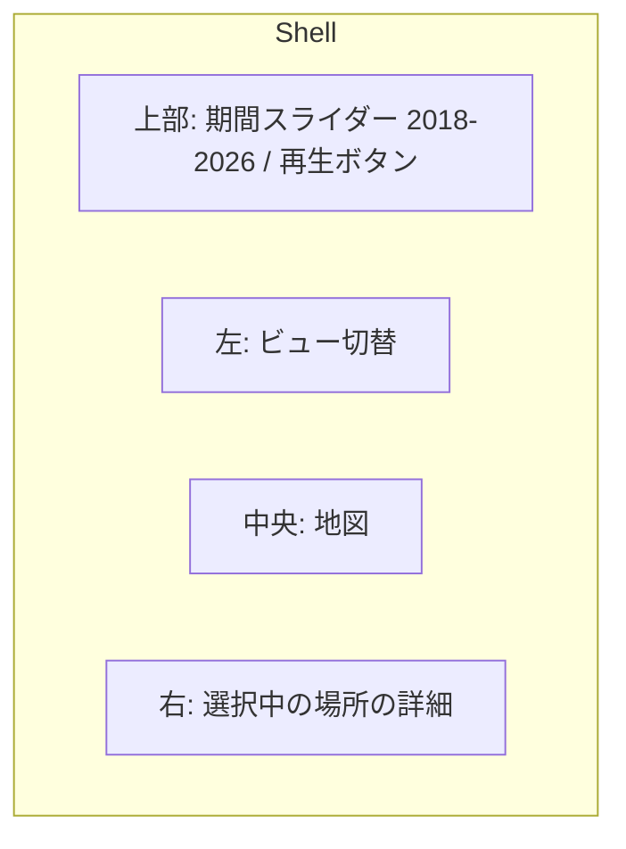

# MyGravityMap 設計書 (v0.1 ドラフト)

Google マップのタイムライン履歴から「自分がどこに引き寄せられて生きてきたか」を
可視化するブラウザアプリ。**データは一切サーバへ送らない**（完全クライアントサイド）。

- 作成日: 2026-08-20
- ステータス: ドラフト（実装着手前のレビュー用）

---

## 1. 実データの調査結果（設計の前提）

`Sampledata/location-history.json` を実測した結果。設計判断はすべてこの数字に基づく。

| 項目 | 実測値 |
|---|---|
| ファイルサイズ | 74.1 MB（整形済み JSON） |
| 期間 | 2018-04-30 〜 2026-08-20（約 8 年 4 か月） |
| `semanticSegments` | 19,583 件 / 14.4 MB |
| `rawSignals` | 72,744 件 / **29.7 MB** |
| `userLocationProfile` | 1 件（HOME / WORK ラベル付き頻出地点 10 件） |

### 1.1 セグメントの内訳

| 種別 | 件数 | 中身 |
|---|---|---|
| `timelinePath` | 11,918 | 2 時間バケットの粗い軌跡。合計 **118,405 点** |
| `activity` | 3,824 | 移動区間（起終点・距離・交通手段・駐車位置） |
| `visit` | 3,743 | 滞在（placeId・座標・semanticType・確率） |
| `timelineMemory` | 98 | 旅行のまとまり（原点からの距離 km・目的地 placeId 群） |

### 1.2 ★最重要★ 年による情報量の断絶

| 年 | visit | activity | timelinePath |
|---|---|---|---|
| 2018–2023 | **0** | **0** | 4,958 |
| 2024 | 307 | 336 | 2,419 |
| 2025 | 1,868 | 1,926 | 2,833 |
| 2026 | 1,568 | 1,562 | 1,708 |

Google がタイムラインを端末内処理に移行した 2024 年秋以降しか `visit`（＝訪問場所）が存在しない。
**`visit` だけを描画するアプリにすると、8 年のうち 6 年が「線だけの空白期間」になる。**

→ 本アプリは **「Google の visit」と「timelinePath から自前で復元した滞在」を統合した
　 単一の Place モデル**を持つ。これが設計上の中核。

### 1.2.1 さらに厄介な点: 年ごとに「記録の濃さ」が違う

`timelinePath` は 2 時間バケットなので、`1 日あたりのバケット数 × 2 時間` が
その年の「記録されていた時間」の上限になる。実測:

| 年 | 記録のある日数 | バケット/日 | 点/日 | 記録カバレッジ（時間/日） |
|---|---|---|---|---|
| 2019 | 275 | 3.1 | 22.5 | **約 6.2 h** |
| 2020 | 237 | 2.8 | 22.4 | 約 5.5 h |
| 2021 | 257 | 3.1 | 28.3 | 約 6.2 h |
| 2022 | 331 | 3.5 | 39.0 | 約 6.9 h |
| 2023 | 337 | 4.5 | 53.8 | 約 9.0 h |
| 2024 | 360 | 6.7 | 51.6 | 約 13.4 h |
| 2025 | 365 | 7.8 | 80.1 | **約 15.5 h** |
| 2026 | 232 | 7.4 | 89.4 | 約 14.7 h |

2019 年は 1 日のうち約 6 時間分しか記録が無い。しかも記録されるのは「動いた／電波を拾った」
ときだけなので、**じっとしていた時間はそもそも記録に存在しない**。

**結論: 2018–2023 について復元できるのは「そこに居たという事実」であって「何時間居たか」ではない。**

この事実を無視して滞在時間を単純合計すると、**生活が変わったからではなく
エクスポート形式が変わったから 2025 年が重い**、という嘘の絵が出る。
§2 の重力スコアと §4 のデータモデルは、この非対称性を前提に設計する。

### 1.3 その他の実測事実と、そこから来る制約

| 事実 | 設計への影響 |
|---|---|
| `visit` に**場所名が無い**（placeId と緯度経度のみ） | 名前は別途解決が必要（§8 A） |
| `semanticType` は UNKNOWN 2,518 / WORK 548 / INFERRED_WORK 327 / INFERRED_HOME 301 / HOME 43 / SEARCHED_ADDRESS 6 | 自宅・職場は自動着色できる。それ以外は無名 |
| `userLocationProfile.frequentPlaces` に HOME/WORK ラベル | 地理コーディング無しで得られる唯一の名前。v1 で活用 |
| `hierarchyLevel` 1 の 623 件中 **622 件が level 0 の訪問と時間重複** | 滞在時間の合計で**二重計上する**。集計は level 0 を既定とする |
| 同一 placeId の座標ぶれは概ね 30 m 未満（例外 1 件 273 m） | 集約キーとして placeId をそのまま使える |
| 座標は `"35.0000000°, 135.0000000°"` のような**文字列**（`°` はマルチバイト） | `°` 分割ではなく数値の正規表現で抽出する |
| 全セグメントに `startTimeTimezoneUtcOffsetMinutes` | 「何曜日の何時にいたか」は**記録側のオフセット**で計算する（ブラウザのローカル時刻を使うと海外滞在分が別の日にずれる） |
| 記録範囲が国内に収まらない（海外滞在を含み、経度で 100 度以上の広がり） | 国内前提にできない。世界スケールのズームと「遠征」ビューが要る |
| `rawSignals` に **Wi-Fi MAC アドレス 143,075 件** | 取り込み時に破棄。ファイルの 40 % を捨てるので性能にも効く |
| 移動手段: 自動車 2,603 / 徒歩 1,100 / 電車 36 / 路面電車 29 / バス 23 / 自転車 23 ほか | 交通手段別の距離・色分けが成立する |
| 訪問の中央値 51 分 / 訪問のある日 528 日 | 短時間の立ち寄りが多い。閾値フィルタ（10 分未満を除く等）が必要 |

---

## 2. コンセプト

> **重力＝その場所が自分を引き寄せた総量。**

滞在時間と訪問回数から場所ごとの「質量」を計算し、地図上に重力井戸（3D 六角柱／ヒートマップ）
として描く。自宅・職場という巨大な重力源と、その周りに散らばる小さな重力源、
そして年に数回だけ遠くへ飛ぶ「脱出速度」を一枚の絵にする。

主要指標:

- **質量 (mass)** — 2 モードを持ち、UI で切り替える。既定は**頻度モード**。
  - **頻度モード（全期間で使える。既定）**: `mass = 訪問した日数`（同じ日の再訪は 1 回に丸める）。
    記録の濃さの影響を受けにくく、2018–2026 を通して比較できる。
  - **時間モード（2024 年 10 月以降のみ）**: `mass = Σ滞在時間`。Google の `visit` があるため信頼できる。
    期間フィルタが 2024 年より前を含むときは選択不可にし、理由を UI に表示する。
- **年内正規化** — 年をまたいで比べるときは、生の値ではなく**その年の中での順位（パーセンタイル）**で
  色と高さを決める。「2019 年の自分にとって重かった場所」と「2025 年の自分にとって重かった場所」を
  同じ土俵に乗せるため。生の値も切り替えられるようにするが、既定は正規化 ON。
- **重心 (barycenter)** = 滞在の平均座標。**時間加重は 2024 年以降のみ**、それ以前は訪問日数加重。
- **回転半径 (gyration radius)** = 重心からの RMS 距離（重みは上と同じ規則）。行動範囲の広さ。
- **脱出 (escape)** = 重心から N km 以上離れた滞在＝旅行。記録密度に依存しないので全期間で有効。

そして、**重力マップが「蓄積した結果」なら、タイムライン再生は「それができていく過程」**。
この 2 つで 1 セットとして扱う（§6）。同じ期間フィルタを共有し、重ねて表示もできる。

---

## 3. アーキテクチャ


- **完全クライアントサイド**の静的 SPA。バックエンド無し。ネットワークに出るのは
  地図タイルの取得のみ（＋任意で地名解決 §8 A）。位置データは 1 バイトも外に出ない。
- 配信は GitHub Pages（静的ホスティング）を想定。

### 3.1 技術選定

| 層 | 採用 | 理由 |
|---|---|---|
| ビルド | **Vite + TypeScript** | 静的出力、Worker バンドルが容易 |
| UI | **React 19** | 状態が多い（時間フィルタ×地図×選択）ため素の DOM は不利 |
| 地図 | **MapLibre GL JS** | API キー不要・OSS。ベクタタイルで世界スケール |
| 描画 | **deck.gl** (`HexagonLayer` / `HeatmapLayer` / `TripsLayer`) | 118,405 点を GPU 集計。「重力井戸」の 3D 表現がそのまま作れる |
| 解析 | **Web Worker + `@streamparser/json`** | 74 MB を `JSON.parse` 一発で読むとメインスレッドが数秒固まる。ストリームなら進捗表示でき、`rawSignals` を読み飛ばせる |
| 永続化 | **IndexedDB**（`idb`） | 2 回目以降は再解析不要。地名キャッシュとユーザー編集ラベルも同居 |
| 状態管理 | **Zustand** | 軽量。Worker からの流し込みと相性が良い |
| テスト | **Vitest**（パーサ・集計）/ **Playwright**（E2E スモーク） | 数値ロジックは単体テストで固める |

代替案として Leaflet + leaflet.heat も検討したが、10 万点超のインタラクティブ集計と
3D 表現で deck.gl が明確に有利なため採用しない。

### 3.2 性能方針

- 取り込み時に `rawSignals`（29.7 MB）を**オブジェクト化せずに読み飛ばす**。
  ストリーム上は 30 MB を字句解析するので**パース時間はさほど減らないが、
  メモリのピークが大きく下がる**（オブジェクト化すると数百 MB 規模になる）。
  なお `userLocationProfile` はファイル上 `rawSignals` の**後ろ**にあるため、
  途中でストリームを打ち切ることはできない（最後まで読む必要がある）。
- 座標は `Float32Array`、時刻は `Int32Array`（Unix 秒）の**列指向**で保持。
  118,405 点 ≒ 約 2 MB。オブジェクト配列（推定 30 MB 超）より桁で軽い。
- 目標: 初回取り込み 10 秒以内、2 回目以降の起動 1 秒以内、地図操作 60 fps。
  ※これは目標値であり、実測は P0 完了時にベンチマークして本書へ追記する。

---

## 4. データモデル

```ts
/** 生 JSON を正規化した中間表現 */
type Visit = {
  start: number;            // Unix 秒
  end: number;
  tzOffsetMin: number;      // 記録側の UTC オフセット
  lat: number; lon: number;
  placeId?: string;         // Google の visit のみ
  semanticType: 'HOME' | 'WORK' | 'INFERRED_HOME' | 'INFERRED_WORK'
              | 'SEARCHED_ADDRESS' | 'UNKNOWN';
  hierarchyLevel: 0 | 1;
  probability: number;
  source: 'google' | 'derived';   // ★ 出所を必ず持つ（2024 年で品質が変わるため）
  /** 滞在時間を数値として信用してよいか。derived は false（§1.2.1） */
  durationReliable: boolean;
};

type Move = {
  start: number; end: number; tzOffsetMin: number;
  from: [number, number]; to: [number, number];
  distanceMeters: number;
  mode: 'IN_PASSENGER_VEHICLE' | 'WALKING' | 'IN_TRAIN' | 'IN_BUS'
      | 'IN_TRAM' | 'IN_SUBWAY' | 'CYCLING' | 'MOTORCYCLING' | 'RUNNING' | 'UNKNOWN';
  probability: number;
  parking?: { lat: number; lon: number; time: number };
};

/** 軌跡は列指向で保持（オブジェクト配列にしない） */
type Track = { lat: Float32Array; lon: Float32Array; t: Int32Array };

/** 集約後の「場所」＝アプリの主役 */
type Place = {
  id: string;               // placeId、無ければ 'grid:<geohash>'
  lat: number; lon: number; // 代表点（滞在時間加重重心）
  label?: string;           // ユーザー編集 or 地名解決の結果
  semanticType: Visit['semanticType'];
  visitCount: number;       // 訪問回数
  visitDays: number;        // ★ 訪問した「日数」＝頻度モードの質量
  reliableSeconds: number;  // ★ durationReliable な滞在のみの合計（2024/10 以降）
  observedSeconds: number;  // 参考値。derived を含む合計。年をまたいで比較しないこと
  firstSeen: number; lastSeen: number;
  massFreq: number;         // 頻度モードの重力スコア
  massTime: number | null;  // 時間モード。信頼できる区間が無ければ null
  byYear: Record<number, {
    days: number;           // その年に訪問した日数
    count: number;
    reliableSeconds: number;
    observedSeconds: number;
  }>;
  byHour: Int32Array;       // 24 要素。滞在の時間帯プロファイル
  byWeekday: Int32Array;    // 7 要素
  sources: ('google' | 'derived')[];
};

/** 年ごとの記録の濃さ。正規化と UI の警告表示に使う（§1.2.1） */
type YearCoverage = {
  year: number;
  recordedDays: number;
  coverageHoursPerDay: number;   // バケット数 × 2h / 記録日数
  hasGoogleVisits: boolean;      // false の年は時間モードを禁止する
};
```

### 4.1 取り込みパイプライン

1. **パース**: `$.semanticSegments.*` のみをストリームで拾う。`rawSignals` は破棄。
2. **正規化**: 座標文字列 → 数値（正規表現 `-?\d+\.?\d*` を 2 つ抽出）。
   時刻 → Unix 秒 + tzOffsetMin。
3. **滞在の復元**（2018–2023 対策）:
   `timelinePath` の点列に対し「半径 R 以内に T 分以上とどまった塊」を滞在とみなす
   （初期値 R = 120 m、T = 25 分。2 時間バケットの粗さに合わせた値で、UI で調整可）。
   Google の `visit` と時間が重なる区間では **Google 側を優先**し、derived は捨てる。
   - **現在の実装（`core/visits.ts`）は簡略版**。点列を直接クラスタリングせず、
     トリップ分割の結果を使って「トリップ間の隙間」を見る。隙間が T 以上あり、かつ
     隙間の前後の点の距離が R 以内なら滞在とみなす（T の既定は 1 時間、R = 120 m）。
     R は「留まっていた」と「移動中に記録が落ちた」を分けるために効く。
     T / R の UI 露出はまだ無い。パラメータの妥当性は未決事項 D の検証待ち。
4. **場所集約**: `placeId` があればそれをキー、無ければ約 100 m グリッド（geohash 精度 7）でキー化。
   さらに 150 m 以内の重心同士をマージして「同じ建物が別 ID で割れる」問題を吸収。
5. **二重計上の回避**: 滞在時間の集計は `hierarchyLevel === 0` のみ。
   level 1 は「親（施設全体）」として別ビューでのみ使う。
6. **トリップ分割**（順序が重要。§6.1）:
   ① 全点を時刻順に並べ重複除去 → ② 同時刻・別座標を丸めて**時刻を単調増加にする** →
   ③ 飛行区間（200 km/h 超かつ 100 km 超）に**大圏補間の中間点を挿入** →
   ④ 30 分以上の空白で切って `Trip` を作る → ⑤ `activity` と時間で突き合わせて交通手段を付ける。
   ③ を ④ より先にやらないと、長距離便が必ず切られて `isFlight` が立たない。
7. **カバレッジ算出**: 年ごとに `YearCoverage` を計算する（§1.2.1 の表を実データから毎回作る）。
   正規化・時間モードの可否判定・UI の警告表示がすべてこれを参照する。
8. **保存**: IndexedDB へ。ファイルのハッシュをキーにして、同じファイルなら再解析しない。

---

## 5. 画面構成



すべてのビューが**共通の期間フィルタ**（年・月・曜日・時間帯）に反応する。

期間スライダーには**データ品質バンド**を重ねる。年ごとの記録カバレッジ（§1.2.1）を
帯の濃さで示し、2018–2023 の区間には「軌跡のみ・滞在時間なし」と明示する。
2024 年より前を含む選択をしたときは、時間モードを自動で無効化し、理由を出す。
「絵が薄い」のがデータの問題なのか生活の問題なのかを、常に見て分かるようにする。

| # | ビュー | 内容 | 優先度 |
|---|---|---|---|
| 1 | **タイムライン再生** | 期間を選んで移動を早送り再生。移動痕が残る。詳細は **§6** | **P1** |
| 2 | **重力マップ** | 六角柱の高さ＝質量。ズームで粒度自動変更 | P1 |
| 3 | **場所ランキング** | 滞在時間 / 訪問回数の上位表。行クリックで地図が飛ぶ。ラベル編集はここ | P1 |
| 4 | **軌跡（静止）** | 期間内の全軌跡を一度に重ね描き。再生の「終了状態」と同じ絵 | P1 |
| 5 | **カレンダー** | GitHub 草風の年 × 日ヒートマップ（移動距離 or 訪問数）。空白期間も一目で分かる | P2 |
| 6 | **重心の変遷** | 年ごとの重心と回転半径を地図上でアニメーション | P2 |
| 7 | **遠征 / 旅行** | `timelineMemory` + 重心から N km 超の滞在を旅行として抽出、日程順に一覧 | P2 |
| 8 | **統計** | 交通手段別の距離・時間、時間帯プロファイル、初訪問の場所数の推移 | P2 |

再生と重力マップは**排他ではなく重ねられる**（薄く出した重力マップの上を軌跡が流れる）。

---

## 6. タイムライン再生（移動の早送り）

期間を選び、その間の移動を時間順に早送りで流す。通った跡は**グラデーション**または
**実線**で地図上に残る（設定で切替）。重力マップと並ぶ、もう一つの主役ビュー。

### 6.1 実データから見た前提（点の粗さ）

`timelinePath` の点を時刻順に並べ、隣り合う点の間隔と推定速度を実測した。

| 点と点の間隔 | 件数 |
|---|---|
| 2 分以内 | 40,726 |
| 2–10 分 | 45,190 |
| 10–30 分 | 14,148 |
| 30 分–2 時間 | 4,679 |
| 2 時間–1 日 | 4,613 |
| 1 日超 | 332 |

中央値 4 分 / p75 10 分 / p90 25 分。1 日あたりの点数は 2019 年で中央値 19 点（≒75 分に 1 点）、
2025 年で 69 点（≒20 分に 1 点）。推定速度は中央値 9 km/h、p99 108 km/h、**最大 765 km/h**。

さらに 2 点:

- 200 km/h 超は 61 区間。うち **59 区間は 30 分以内**（4–16 分で 36–79 km＝新幹線や国内線）、
  **2 区間だけが 12〜14 時間で 9,300 km 超**（677 / 765 km/h＝日本↔欧州の長距離便）。
- **同じ時刻で座標が違う点が 5,338 組**ある（全体の約 5 %）。完全一致の重複除去では消えない。

ここから決まること:

1. **30 分以上あいたら線を切る**（既定）。切らないと空白をまたいで嘘の直線が引かれる。
   閾値 30 分で軌跡は 9,625 本に分かれ、うち 18 % は 1 点だけ（線ではなく点として描く）、
   中央値 6 点、最長 606 点。10 分にすると 41 % が 1 点になり細切れ、
   2 時間にすると空白をまたいでしまう。→ **既定 30 分、設定で 10 / 30 / 120 分**。
2. ★**長距離便は分割の例外にする**★。上の 2 区間は 12〜14 時間あくので、
   素直に 30 分ルールを適用すると**飛行機が必ず切られて `isFlight` が永久に立たない**。
   そこで**分割の前に**「200 km/h 超 かつ 100 km 超」の点対を飛行区間と判定し、
   **大圏コース上の中間点を生成して埋めてから**分割にかける。埋めた点があるので線は切れず、
   弧として描かれる。→ **大圏補間は描画時のトグルではなく取り込み時の処理**
   （`TripsLayer` は与えた点の間を直線で結ぶため、描画側では弧にできない）。
3. **時刻の単調増加を保証する**。同時刻・別座標が 5,338 組あるため、
   取り込み時に「同じ時刻の連続点は最後の 1 点に丸める（または 1 秒ずらす）」を必ず通す。
   これを怠るとシェーダの補間が破綻して線が飛ぶ。
4. **2019 年の再生はなめらかにならない**（75 分に 1 点）。これはデータの限界なので、
   隠さずに「この期間は記録が粗い」と UI に出す。補間方式も選べるようにする。

### 6.2 操作系

- **期間選択**: 2018–2026 のレンジスライダー（データ品質バンド付き）。
  プリセット「この 1 日 / 1 週間 / 1 か月 / 1 年 / 全期間」。
- **再生速度**: 実時間倍率のプリセット ×60（1 分/秒）/ ×600 / ×3600（1 時間/秒）/
  ×86400（1 日/秒）/ ×604800（1 週間/秒）。選択期間の長さから既定を自動決定する
  （全期間なら 1 週間/秒 ≒ 約 7 分で 8 年を再生）。
- 再生 / 一時停止 / スクラブ / ループ / コマ送り（1 日単位）。
- **空白スキップ**: 記録が無い区間（1 日超の空白が 332 件）を自動で飛ばすトグル。
  ON なら 8 年でも中身のある時間だけが流れる。
- **現在時刻表示**: 記録側のタイムゾーンで表示（`2025-03-14 (金) 18:42 JST`）。
  海外滞在中は現地時刻になる。
- **カメラ**: 「現在地を追う」/「全体を固定」/「日ごとに自動フィット」の 3 モード。

### 6.3 移動痕の表現（設定で切替）

| モード | 見え方 | 実装 |
|---|---|---|
| **グラデーション**（既定） | 先頭が明るく後方へ減衰して消える、彗星の尾 | deck.gl `TripsLayer`（`currentTime` + `trailLength`）。尾の長さは 1 時間 / 6 時間 / 1 日 / 1 週間 から選択 |
| **実線（残る）** | 通った線が消えずに残り、進むほど地図が塗り重なる | `PathLayer` に「現在時刻までに通過した部分」を渡す。加算合成にすると重複した道が濃くなり、生活動線が浮かぶ |
| **両方** | 残る実線を薄く敷き、先頭にグラデーションの尾 | 上 2 つの重ね描き |
| **減衰残光**（P2） | 実線が残るが数日かけて薄れる | 経過時間で alpha を落とす |

- **色分け**: 単色 / 交通手段別 / 年別 / 速度別 / 時間帯別。
- **その他の設定**: 線幅、不透明度、加算合成の ON/OFF、尾の長さ、分割閾値。
- **補間**: 線形（既定）/ 補間なし（点から点へ跳ぶ）。
  飛行区間の大圏補間は取り込み時に済ませてある（§6.1-2）ので、ここでは切り替えない。

### 6.4 データ構造と性能

```ts
/** 再生の単位。取り込み時に一度だけ切って IndexedDB に保存する */
type Trip = {
  origin: [number, number];  // このトリップの基準点（METER_OFFSETS の原点）
  path: Float32Array;        // origin からのメートル offset [x, y, x, y, ...]
  tRel: Float32Array;        // ★選択期間の開始からの相対秒（絶対 Unix 秒ではない）
  tStart: number;            // 絶対 Unix 秒（フィルタ・表示用）
  tEnd: number;
  mode: Move['mode'];        // activity セグメントと時間で突き合わせて推定
  year: number;
  isFlight: boolean;         // 大圏補間を入れた飛行区間を含む
};
```

★**時刻を絶対 Unix 秒のまま GPU に渡してはいけない。**
`TripsLayer` はタイムスタンプを float32 の頂点属性として扱う。
Unix 秒（約 1.79 × 10⁹）は 2³⁰〜2³¹ の範囲にあるので、float32 で表せる**刻みは 128 秒**
（実測: `Math.fround(1700000000) === Math.fround(1700000060)`）。
点間隔は 2 分以内が 40,726 件あり、その多くが隣と同じ値に潰れて
`Trip.times` の「厳密に単調増加」という前提が壊れる。尾もガタつく。

→ **タイムスタンプは「選択中の期間の開始時刻からの相対秒」で持つ**。得られる分解能:

| 選択期間 | 相対秒の最大値 | float32 の刻み |
|---|---|---|
| 1 日 | 86,400 | 約 0.005 秒 |
| 1 年 | 3.15 × 10⁷ | 約 1.9 秒 |
| 全期間（8 年） | 2.5 × 10⁸ | 約 15 秒 |

全期間の 15 秒は、その速度（×604800 = 1 秒で 1 週間）では 1 フレーム未満に相当するので実害は無い。

- 座標も同様に、生の経度緯度を Float32 で持つと**東経 137 度あたりで 1–2 m に量子化**され、
  徒歩の軌跡を高ズームで見るとギザギザになる。トリップごとに原点を持たせて
  `COORDINATE_SYSTEM.METER_OFFSETS` で描く。
- 全期間でも重複除去後 115,027 点 ≒ 約 1.4 MB。**期間を変えない限り**、
  グラデーションモードは `currentTime` を更新するだけでフレームごとの CPU 仕事がほぼ無い。
  ただし**期間を変えたら `tRel` を計算し直して GPU に再アップロードする**（上記の理由）。
  これは期間変更の 1 回だけで、再生中には起きない。
- 「実線が残る」モードは毎フレーム全配列を作り直すと重い。
  トリップを**完了 / 進行中 / 未来**の 3 つに分け、**進行中のものだけ部分パスを作る**。
  完了分は差分でしか変わらないので使い回す。
- 再生・重力マップ・ランキングは**同じ期間フィルタと同じストア**を見る（状態を二重管理しない）。
- 目標: 全期間再生で 60 fps 維持。P1 完了時に実測して本書に追記する。

### 6.5 止まっている時間をどう見せるか

移動していない間は点が動かず「何も起きていない」ように見える。滞在中は現在地に円を出し、
**滞在時間に応じて半径を大きくする**（`ScatterplotLayer`）。滞在が終わると縮み、
その場所に小さなマーカーが残る。訪問の中央値は 51 分なので、
×86400（1 日/秒）では 1 秒未満の出来事になる。速度が速いときは滞在円を描かない閾値を設ける。

---

## 7. ロードマップ

| フェーズ | 完了条件（動く状態） |
|---|---|
| **P0 基盤** | Vite+TS+React 雛形、Worker でファイルを解析して件数を表示、IndexedDB に保存、地図が出る |
| **P1a 再生** | 期間選択 + **タイムライン再生**（グラデーション / 実線の切替、速度プリセット、空白スキップ、滞在円）。トリップ分割込み |
| **P1b 重力** | 重力マップ / ランキング / 静止軌跡 + データ品質バンド。derived 滞在復元込み。**8 年分が頻度モードで見える**（時間モードは 2024 年 10 月以降のみ） |

P1a を先にしたのは依存関係の都合（再生はトリップ分割・期間フィルタ・地図だけで作れるが、
重力マップは滞在復元とその精度検証が要る）。**順番の入れ替えは可能**なので、
重力マップを先に見たい場合は入れ替える。
| **P2 拡張** | カレンダー・重心変遷・遠征・統計、減衰残光モード、ラベル編集の永続化 |
| **P3 仕上げ** | 再生の GIF / WebM 書き出し、PNG / GeoJSON 書き出し、任意の地名解決、GitHub Pages 公開、PWA（オフライン動作） |

---

## 8. 決定事項と未決事項

### 決定済み（2026-08-20）

- **A. 場所名 → A-1 + A-2（任意）で確定。**
  既定は手動ラベル（完全オフライン）。`userLocationProfile` の HOME / WORK と
  `semanticType` の HOME / WORK / INFERRED_* は自動でラベル付けする。
  Nominatim による自動取得は**利用者が明示的にボタンを押したときだけ動く任意機能**として
  P3 で追加する（送信内容の明示・1 req/秒・結果は IndexedDB に永続キャッシュ・
  適切な User-Agent を必須とする）。
- **B. 公開範囲 → private リポジトリで開始。** 公開はデモ用合成データを用意してから再検討する。

### 参考: 場所名の 3 案（比較）

| 案 | 内容 | 長所 | 短所 |
|---|---|---|---|
| A-1 | 名前を出さない。座標＋ユーザー手動ラベル（IndexedDB 保存） | 完全オフライン。実装最小 | 824 か所を自分で名付ける |
| A-2 | OSM Nominatim で逆ジオコーディング（1 req/秒・キャッシュ必須） | 無料・キー不要。地名が自動で入る | 824 か所で約 14 分。座標を外部に送る（＝プライバシー方針の例外）。利用規約順守が必要 |
| A-3 | Google Places API（利用者自身のキー） | placeId から正式名称。精度最高 | 課金・キー管理。座標/ID を外部送信 |

### 未決事項

- **C. デモ用データ** — 将来 public 化する場合、他人が試せる合成データ（架空の都市の履歴）を作るか。
  実データの縮約版は座標そのものが個人情報なので**使わない**。
- **D. 滞在復元のパラメータ** — 検証方法は実装した（`npm run validate:visits`、
  `tests/validate-visits.harness.ts`）。残っているのは R の既定値をどこに置くかの判断だけ。

  方法: 2025 年（正解となる Google `visit` があり、記録が濃い）の `timelinePath` を
  2019 年の密度まで間引いてから復元し、同じ期間の `visit` と突き合わせる。
  間引きは 2 段構え（薄さの中身が「その時間帯ごと記録が無い」と「点が粗い」の 2 種類あるため）:
  2 時間バケットを 41%、残ったバケット内の点を 69% 残すと
  3.3 バケット/日・6.5 h/日となり、2019 年の実測（3.2 バケット/日・6.4 h/日）にほぼ一致する。

  結果（開発機の実データ。正解 1,577 件。判定は「正解の長さの 50% 以上に重なれば復元成功」、
  適合率は derived 側の 50% 以上が正解に重なり、かつ 250m 以内のもの）:

  | R | 復元件数 | 再現率 | 適合率 | 位置誤差 中央 | 同 p75 | 吸収 |
  |---|---|---|---|---|---|---|
  | 60m | 654 | 15% | 55% | 40m | 1,435m | 1.96 |
  | 120m（現在の既定） | 727 | 18% | 56% | 43m | 1,435m | 1.84 |
  | 250m | 801 | 20% | 56% | 60m | 1,201m | 1.73 |
  | 500m | 866 | 23% | 55% | 76m | 1,099m | 1.68 |
  | 1000m | 916 | 27% | 53% | 103m | 1,053m | 1.66 |
  | 距離判定なし | 1,370 | 85% | 44% | **1,224m** | 4,232m | 2.29 |

  「吸収」は復元できた正解 ÷ それを担った derived の件数。1.0 なら 1 対 1。
  **再現率はこの数字とセットでしか読めない。** どの R でも 1.7〜2.3 あり、
  1 件の derived が平均 2 件前後の正解を覆って「復元した」ことになっている
  （隙間が長ければ、その中の短い滞在はまとめて覆われるため）。

  分かったこと:
  - **T は効かない。** 軌跡を `trips.ts` の `DEFAULT_GAP_SEC`（30 分）以上の空白で
    切っているので、隙間は必ずそれ以上ある。T をこの閾値より短くしても結果は 1 件も
    変わらない（設計時の T = 25 分は、この構造では到達できない値だった）。
    60 分に上げると件数が 4 割減るが、再現率も適合率もほぼ動かない。効く軸は R だけ。
    これはデータの性質ではなく分割閾値との関係なので、閾値を変えれば下限も動く。
  - **R に鋭い最適値は無い。** 上げるほど再現率が上がり位置誤差が悪化する、なだらかな
    トレードオフ。適合率は 120–250m あたりでわずかに山になる。
  - **距離判定を外したときの再現率 85% は見かけ。** 位置誤差の中央値が 1.2km、
    滞在時間比の中央値が 5.15（正解の 5 倍の長さ）、吸収 2.29。
    実体は「長い隙間を丸ごと 1 件の滞在にしたので、その中の正解をまとめて覆った」だけで、
    復元 1,370 件のうち何かを復元できたのは 585 件ほど。場所としては別物になっている。
  - **濃い年で調整してはいけない、が数字で確認できた。** 間引かない 2025 年で同じ表を作ると
    R = 距離判定なしでも適合率 65%・位置誤差 38m で、R はほとんど効かないように見える。
    濃い年だけで見て「R は要らない」と結論すると、薄い年で 1.2km ずれる。
  - p75 の位置誤差はどの R でも 1km を超える。これは「出かけて戻るまで記録が丸ごと落ちた」
    隙間で、R では原理的に取り除けない（`core/visits.ts` の限界として明記してある）。
- **E. `hierarchyLevel` 1 の意味** — 施設全体を指す親レコードと推定しているが未確定。
  集計は level 0 のみで行い、level 1 は「グルーピング候補」として保持だけしておく。

---

## 9. プライバシー方針（実装ルール）

1. 位置データは **IndexedDB とメモリ以外に出さない**。アップロード機能を作らない。
2. `rawSignals`（Wi-Fi MAC アドレス 143,075 件）は**パース時点で破棄**し、保持しない。
3. 外部通信は地図タイルのみ。地名解決は既定 OFF、有効化時に何をどこへ送るか明示する。
4. スクリーンショット・Issue・PR に実座標を含めない。デバッグログに座標を出さない。
5. `Sampledata/` は `.gitignore` 済み。派生ファイルも同様に除外する（`*.derived.json` 等）。
6. アナリティクス・エラートラッカーは導入しない。

---

## 10. リポジトリ構成（予定）

```
MyGravityMap/
├─ docs/DESIGN.md            この文書
├─ src/
│  ├─ workers/parse.worker.ts    ストリーミング解析
│  ├─ core/                      正規化・滞在復元・集約（純関数、テスト対象）
│  ├─ store/                     Zustand + IndexedDB
│  ├─ views/                     Playback / GravityMap / Ranking / Calendar / Stats
│  └─ ui/
├─ tests/                    Vitest（合成フィクスチャのみ。実データは使わない）
├─ .github/workflows/ci.yml  typecheck + test + build
└─ Sampledata/               ★git 管理外（各自が自分のエクスポートを置く）
```
